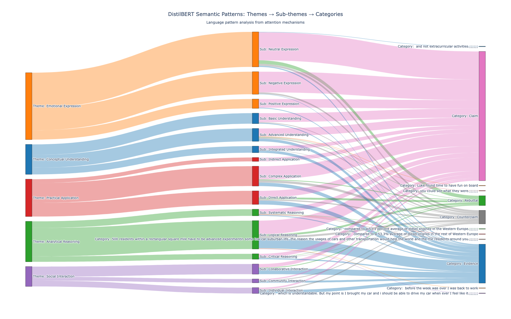

# Npath Text Mining - Semantic Pattern Analysis

Advanced text pattern mining using DistilBERT embeddings and graph-based analysis. Extracts semantic themes from opinion data and visualizes relationships through interactive Sankey diagrams.

## 🎯 Features

- **DistilBERT Semantic Analysis**: Extract semantic embeddings from text using transformer models
- **Theme Extraction**: K-means clustering to identify semantic themes and sub-themes
- **Sankey Visualization**: Interactive flow diagrams showing relationships between themes → sub-themes → categories
- **Graph-Based Pattern Mining**: nPath-like approach for pattern discovery in categorized text
- **CSV Export**: Export pattern mappings for further analysis
- **Google Colab Ready**: Full integration with Jupyter notebooks and Google Colab

## 📊 Visualization Example



*Interactive Sankey diagram showing semantic themes flowing through sub-themes to opinion categories*

## 🚀 Quick Start with Google Colab

1. **Open Notebook**: [npath_text_analysis.ipynb](https://colab.research.google.com/github/hincaltopcuoglu/Npath-text-mining/blob/master/npath_text_analysis.ipynb)

2. **Run Cells in Order**:
   - **Cell 18**: Install DistilBERT dependencies
   - **Cell 19**: Download the analyzer module from GitHub
   - **Cell 20**: Upload your `opinions.csv` file
   - **Cell 21**: Run semantic analysis (5-15 minutes)
   - **Cell 22**: View interactive Sankey diagram
   - **Cell 23**: Analyze pattern distribution
   - **Cell 24**: Download results

## 📋 Data Format

Your CSV file should contain:
- `text`: The text content to analyze
- `type` (or `category`): The label/category for each text

Example:
```csv
text,type
"Artificial intelligence will be very important in the future",Technology
"Healthy eating and regular exercise are essential",Health
"This location has great attractions and activities",Recreation
```

## 🔧 Local Installation

### Using Makefile (Recommended)

```bash
# Setup project environment and install dependencies
make setup

# Or just install dependencies
make install
```

### Manual Installation

```bash
pip install -r requirements.txt
python -m nltk.downloader punkt stopwords
```

## 📁 Project Structure

```
├── README.md                          # This file
├── requirements.txt                   # Python dependencies
├── pyproject.toml                     # Project configuration
├── Makefile                           # Task automation
├── npath_text_analysis.ipynb          # Main Jupyter notebook
├── distilbert_pattern_analyzer.py     # DistilBERT analyzer module
├── text_pattern_miner.py              # Pattern mining engine
├── graph_builder.py                   # Graph construction
├── pattern_finder.py                  # nPath-like pattern finder
├── visualizer.py                      # Visualization utilities
├── utils.py                           # Helper functions
├── main.py                            # Example usage
├── data/
│   ├── raw/                           # Raw input data
│   │   └── opinions.csv               # Sample opinion data
│   └── processed/                     # Processed data
├── docs/                              # Documentation
│   ├── images/                        # Documentation images
│   │   └── sankey_visualization.png   # Sankey diagram example
│   ├── DISTILBERT_README.md           # DistilBERT guide
│   ├── DISTILBERT_IMPLEMENTATION.md   # Implementation details
│   ├── DISTILBERT_COMPLETE.md         # Complete reference
│   └── COLAB_SETUP.md                 # Colab setup guide
└── output_png/                        # Generated visualizations
```

## 🤖 How It Works

### 1. Semantic Theme Extraction
- Uses DistilBERT to generate 768-dimensional embeddings for each text
- Applies K-means clustering to identify 5 main semantic themes
- Further clusters each theme into 3 sub-themes

### 2. Pattern Mapping
- Maps texts to their semantic themes
- Associates each text with its category/type label
- Tracks flow from themes → sub-themes → categories

### 3. Sankey Visualization
- Creates interactive Sankey diagrams showing pattern flows
- Visualizes theme relationships and category distributions
- Enables exploration through hover, click, and navigation

## 📊 Output Files

- **distilbert_patterns_sankey.html**: Interactive Sankey visualization (open in web browser)
- **distilbert_patterns.csv**: Complete pattern mappings for analysis
- **distilbert_results/**: Directory containing analysis artifacts

## 🎮 Interactive Features

The Sankey diagram includes:
- **Hover**: See flow values and details
- **Click**: Explore theme-to-category relationships
- **Drag**: Rearrange nodes for better visibility
- **Save**: Right-click → Save as image

## 📚 Documentation

See the `/docs` folder for detailed guides:
- [DISTILBERT_README.md](docs/DISTILBERT_README.md) - DistilBERT overview
- [DISTILBERT_IMPLEMENTATION.md](docs/DISTILBERT_IMPLEMENTATION.md) - Implementation details
- [COLAB_SETUP.md](docs/COLAB_SETUP.md) - Colab setup instructions
- [REPOSITORY_PUBLIC_GUIDE.md](docs/REPOSITORY_PUBLIC_GUIDE.md) - Public usage guide

## 🔄 Makefile Commands

| Command | Description |
|---------|-------------|
| `make help` | Show all available commands |
| `make setup` | Setup project environment (folders + dependencies) |
| `make install` | Install dependencies only |
| `make create-sample-data` | Create sample data with 4 categories |
| `make load-data` | Verify data files |
| `make preprocess-data` | Preprocess data files |
| `make run` | Run main analysis |
| `make run-custom DATA_FILE=path` | Run with custom data file |
| `make test` | Run module tests |
| `make clean` | Clean temporary files |
| `make info` | Show project status |
| `make all` | Setup, prepare data, and run analysis |

## 💻 Python Usage

```python
from distilbert_pattern_analyzer import DistilBertPatternAnalyzer

# Initialize analyzer
analyzer = DistilBertPatternAnalyzer(results_dir='distilbert_results')

# Extract embeddings and attention patterns
texts = ["Your text here", "Another text"]
embeddings, attention = analyzer.extract_embeddings_and_attention(texts, batch_size=32)

# Extract semantic themes
themes = analyzer.extract_semantic_themes(n_themes=5, n_sub_themes=3)

# Map texts to themes
categories = ["Category1", "Category2"]
analyzer.map_texts_to_themes(texts, categories)

# Create visualization
analyzer.create_sankey_diagram('output.html')

# Export results
df_patterns = analyzer.export_patterns_to_csv('patterns.csv')
```

## 📦 Requirements

- Python 3.8+
- PyTorch
- Transformers (HuggingFace)
- Pandas
- NumPy
- Scikit-learn
- Plotly
- NLTK
- NetworkX

See `requirements.txt` for complete list and versions.

## 🤝 Contributing

Contributions are welcome! Please feel free to submit pull requests or open issues for bugs and feature requests.

## 📝 License

This project is open source and available under the MIT License.

## 👤 Author

Developed as an advanced text mining solution combining graph-based pattern analysis with modern deep learning techniques.

## 🔗 Related Projects

- [Teradata Aster nPath](https://docs.teradata.com/reader/ytCsJiHRKBQSjK7u3_~e_w/nQWHEn8~bZGGLWQZLhf8RA) - Original graph pattern matching approach
- [DistilBERT](https://huggingface.co/distilbert-base-uncased) - Lightweight transformer model
- [Plotly](https://plotly.com/) - Interactive visualization library

## 📞 Support

For issues and questions, please open an issue on GitHub.

---

**Last Updated**: November 2025
